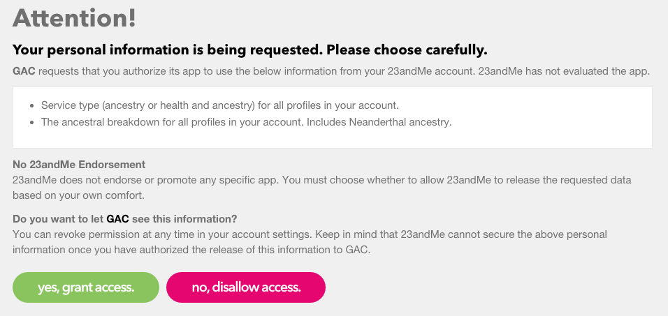

# Genetic Access Control


## What is Genetic Access Control?

Using the [23andme API](https://api.23andme.com/docs/reference/) it is now possible to
utilize genetic profile information and likely phenotypes in custom applications.  This
means you can restrict access to your site based on traits including sex, ancestry,
disease susceptability, and arbitrary characteristics associated with
single-nucleotide polymorphisms (SNPs) in a person's genotype.


## How does it work?

GAC uses the standard third-party authentication mechanism OAuth2 to request minimal
permissions from 23andme on behalf of the user. The user is presented with a dialog
asking them to approve the sharing of certain genetic data with your application.  
If the request is approved a temporary access token is passed to your application
which can be used to make API requests to retrieve information, such as ancestry
composition and SNP nucleotide sequences. This data can then be used to grant
or restrict authorization.


## Possible uses

* Creating "safe spaces" online where frequently attacked and trolled victim groups 
can congregate, such as a female-only community
* Ethnoreligious sects may wish to limit membership, e.g. Hasidic Jewish groups 
restricting access to Ashkenazi or Sephardic maternal haplogroups with the "Cohen" gene
* Safer online dating sites that only partner people with a low likelihood of offspring 
with two recessive genes for congenital diseases
* Pharmacutical applications that check for genetic predisposition to negative drug 
interactions before dispensing
* Ethnic enclaves, e.g. Black Panthers or NAACP members


## Flaws

* It is possible to register a new account, obtain a genetic testing kit for about $100 
and submit a saliva sample from a person who would normally fit the criteria for granting
access, after about six weeks of waiting.
* Many traits such as ancestry composition are speculative and statistical in nature, not
precise. There are adjustible settings for threshold and speculation in the sample code.
* There are unresolved ethical issues regarding trans-*-identifying persons such as
transgender and transethnic users.


## Demonstration

* [Ancestry Authorization Demo](http://rbac23.herokuapp.com)
* You must have a genotyped 23andme account to access the demo. It checks to see if your
ancestral makeup is primarily composed of European (minus Ashkenazi) genetic markers to
determine whether or not access is permitted.

  
  
  


## Running
* Create `instance/rbac.cfg`:
```
CLIENT_ID='a0830ba98c035c9fd9a0c80a'
CLIENT_SECRET='70a65e7876c6b68975a87c67b'
REDIRECT_URI='http://example.com/receive_code'
DEBUG=True
```
* `virtualenv venv`
* `pip install -r requirements.txt`
* `python rbac.py`
